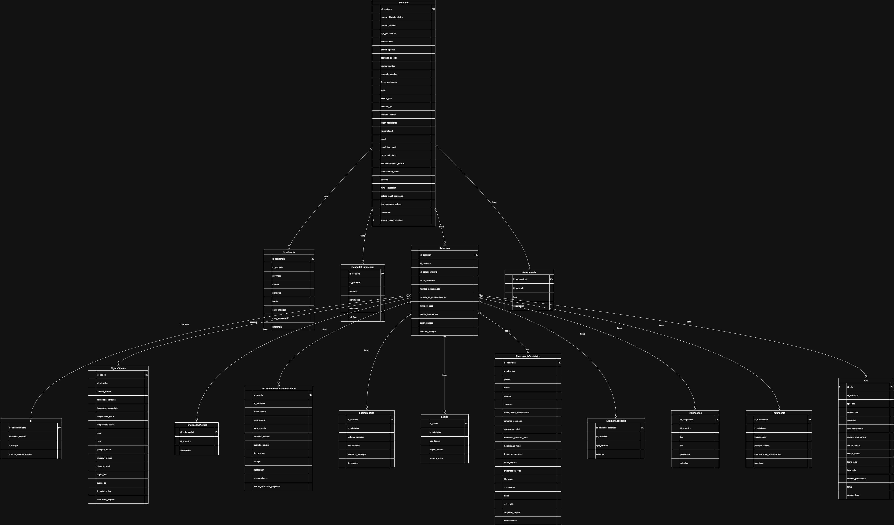
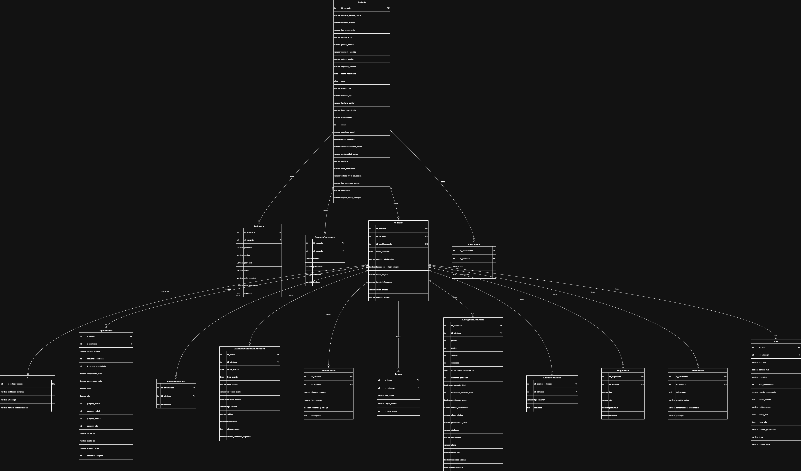

# GRUPO Backend - Modelos Conceptual, Lógico y Físico

## Introducción

En el desarrollo del sistema, seguimos una metodología estructurada para el diseño de la base de datos, utilizando herramientas y recursos proporcionados por nuestros tutores externos. Este documento describe el proceso y los resultados obtenidos en la elaboración de los modelos Conceptual, Lógico y Físico de la base de datos del proyecto.

**Herramientas utilizadas:**

- java-17-openjdk
- nodejs 18
- docker-ce, docker-ce-cli, containerd.io, docker-buildx-plugin, docker-compose-plugin, docker-compose
- postgres:16
- npx jhipster
- git
- vscode
- DBLinks
- JDL (JHipster Domain Language)

## 1. Análisis Exhaustivo del Formulario 008

La base de todo nuestro diseño fue el Formulario 008, presentado en las imágenes `form-008-2021_pages-to-jpg-0001.jpg` y `form-008-2021_pages-to-jpg-0002.jpg`. La primera fase implicó una inmersión forense en cada sección, campo y sub-campo, desglosando la información para comprender no solo su contenido, sino también su estructura, sus interdependencias y las reglas de negocio implícitas que dictaban su uso.

### 1.1 Análisis Inicial y Comprensión del Formulario 008

Todo comenzó con el Formulario 008. Este documento, en sus versiones .xlsm y .pdf, fue la piedra angular de nuestro entendimiento. La primera fase se centró en una lectura exhaustiva y una descomposición meticulosa de cada sección, campo y nota. No se trataba solo de identificar los datos, sino de comprender su significado, su relación con otros elementos y las reglas de negocio implícitas.

El equipo se reunió para discutir cada campo: ¿es este un dato de entrada o un dato derivado? ¿qué tipo de información almacena? ¿existen dependencias entre campos? Por ejemplo, la sección de 'Datos del Paciente' no solo requería almacenar nombres y cédulas, sino también entender la lógica detrás de la 'edad' (calculada a partir de la fecha de nacimiento) o la 'nacionalidad' (que podría influir en otros procesos). La versión .xlsm fue particularmente útil para identificar las validaciones y fórmulas preexistentes, lo que nos dio pistas sobre las restricciones de integridad y los tipos de datos.

Se crearon listas preliminares de entidades potenciales: Paciente, Establecimiento, Admisión, Atención, etc. Cada una con sus atributos iniciales. Este fue un ejercicio de abstracción, de pasar de un documento plano a una representación más estructurada de la información. Las preguntas abundaban: ¿es 'ocupación' una entidad separada o un atributo de 'Paciente'? ¿cómo manejamos las múltiples 'causas de atención'? Estas discusiones iniciales, a menudo con pizarras llenas de garabatos y flechas, fueron cruciales para sentar las bases de lo que vendría después.

El objetivo de esta fase era lograr una comprensión compartida y sin ambigüedades del dominio del problema. Cualquier malentendido aquí se magnificaría en las etapas posteriores. Por ello, se dedicó un tiempo considerable a la clarificación, incluso consultando con expertos en el ámbito de la salud para disipar dudas sobre la terminología o los flujos de trabajo subyacentes al formulario. Esta inmersión nos permitió construir un glosario de términos y una primera aproximación a las reglas de negocio, elementos esenciales para la siguiente fase: el diseño conceptual.

**Análisis Detallado de las Secciones del Formulario:**

- **Página 1: `form-008-2021_pages-to-jpg-0001.jpg`**

  - **A. DATOS DEL ESTABLECIMIENTO**: Esta sección, ubicada en la parte superior, nos proporcionó los campos `INSTITUCION DEL SISTEMA`, `UNICODIGO`, `ESTABLECIMIENTO DE SALUD`, `NUMERO DE HISTORIA CLINICA UNICA` y `NUMERO DE ARCHIVO`. Estos elementos fueron cruciales para definir la entidad `Establecimiento` en nuestros modelos. La presencia de un `UNICODIGO` sugiere un identificador único a nivel nacional o de sistema, lo que lo convierte en un candidato ideal para una clave primaria o un campo con restricción de unicidad. El `NUMERO DE HISTORIA CLINICA UNICA` y `NUMERO DE ARCHIVO` apuntan a la necesidad de vincular la admisión del paciente a un registro institucional, lo que nos llevó a considerar la relación entre `Admisión` y `Establecimiento`.

  - **B. REGISTRO DE ADMISION**: Esta es una de las secciones más densas y fundamentales. Incluye `FECHA DE ADMISION`, `NOMBRE Y APELLIDO DEL ADMISIONISTA`, y `HISTORIA CLINICA EN ESTABLECIMIENTO`. Los datos del paciente se desglosan en `PRIMER APELLIDO`, `SEGUNDO APELLIDO`, `PRIMER NOMBRE`, `SEGUNDO NOMBRE`, `CEDULA`, `FECHA DE NACIMIENTO`, `LUGAR DE NACIMIENTO`, `NACIONALIDAD`, `EDAD`, `SEXO`, `ESTADO CIVIL`, `NIVEL DE EDUCACION`, `OCUPACION / PROFESION`, `TIPO DE EMPRESA DE TRABAJO`, `SEGURO SALUD PRINCIPAL`, `GRUPO CULTURAL`, `AUTODENTIFICACION ETNICA`, y `PUEBLOS`. La granularidad de los nombres y apellidos sugirió campos separados para facilitar la búsqueda y el ordenamiento. La `CEDULA` se identificó como un identificador único para el `Paciente`. La `EDAD` se reconoció como un campo derivado de la `FECHA DE NACIMIENTO`, lo que nos llevó a la decisión de no almacenarla directamente, sino calcularla. Los campos de `ESTADO CIVIL` y `GRUPO SANGUINEO RH` (este último en la página 2) claramente apuntaban a la necesidad de tipos enumerados o tablas de referencia para garantizar la consistencia de los datos. La sección de `RESIDENCIA` con `PROVINCIA`, `CANTON`, `PARROQUIA`, `BARRIO O SECTOR`, `CALLE PRINCIPAL`, `CALLE SECUNDARIA` y `REFERENCIA` nos guio a la creación de entidades geográficas (`Provincia`, `Canton`, `Parroquia`) y una entidad `Residencia` para normalizar la información de ubicación del paciente. Finalmente, la sección `EN CASO NECESARIO LLAMAR A:` con `PARENTESCO`, `DIRECCION` y `TELEFONO` indicó la necesidad de una entidad separada para `Contacto_Emergencia` o atributos dentro de `Paciente`.

  - **C. INICIO DE ATENCION**: Esta sección, con `FECHA`, `HORA`, `CONDICION DE LLEGADA` (`ESTABLE`, `INESTABLE`, `FALLECIDOS`) y `MOTIVO DE ATENCION`, fue clave para la entidad `Atención`. La `CONDICION DE LLEGADA` es otro claro ejemplo de un tipo enumerado.

  - **D. ACCIDENTE, VIOLENCIA, INTOXICACION**: Esta sección detallada, con campos como `FECHA`, `HORA`, `LUGAR DEL EVENTO`, `DIRECCION DEL EVENTO`, `CUSTODIA POLICIAL`, `NOTIFICACION` y una serie de tipos de accidentes (`ACCIDENTE DE TRANSITO`, `CAIDA`, `QUEMADURA`, etc.), nos llevó a la creación de la entidad `Accidente` y una tabla de detalles (`Detalles_accidente`) para manejar los múltiples tipos de incidentes que podrían ocurrir. La presencia de `OBSERVACIONES` y `SUGESTIVO DE ALIENTO ALCOHOLICO` indicó la necesidad de campos de texto más largos y booleanos.

  - **E. ANTECEDENTES PATOLOGICOS PERSONALES Y FAMILIARES**: Esta sección, con categorías como `ALERGICOS`, `CLINICOS`, `GINECOLOGICOS`, `TRAUMATOLOGICOS`, `PEDIATRICOS`, `QUIRURGICOS`, `FARMACOLOGICOS`, `HABITOS`, `FAMILIARES` y `OTROS`, sugirió una tabla de `Antecedentes` con un tipo de antecedente y una descripción asociada, permitiendo múltiples entradas por paciente.

  - **F. ENFERMEDAD O PROBLEMA ACTUAL**: Este campo de texto largo, con indicaciones de `CRONOLOGIA`, `LOCALIZACION`, `CARACTERISTICAS`, `INTENSIDAD`, `FRECUENCIA` y `FACTORES AGRAVANTES`, se mapeó directamente a un campo de texto en la entidad `EnfermedadActual`.

- **Página 2: `form-008-2021_pages-to-jpg-0002.jpg`**

  - **G. CONSTANTES VITALES Y ANTROPOMETRIA**: Incluye `PRESION ARTERIAL`, `PULSO`, `FRECUENCIA RESPIRATORIA`, `TEMPERATURA`, `PESO`, `TALLA`, `GLICEMIA CAPILAR`, `SATURACION DE OXIGENO`, `GLASGOW INICIAL`, `OCULAR`, `VERBAL`, `MOTORA`, `PERIMETRO CEFALICO` y `LLENADO CAPILAR`. Estos campos se agruparon en una entidad `SignosVitales`, con una relación uno a muchos con `Admisión`, ya que un paciente puede tener múltiples registros de signos vitales durante una admisión.

  - **H. EXAMEN FISICO** e **I. EXAMEN FISICO DE TRAUMA / CRITICO**: Estas secciones, con una lista de partes del cuerpo y sistemas (`PIEL - FANERAS`, `CABEZA`, `OJOS`, `OIDOS`, `NARIZ`, `BOCA`, `ORO FARINGE`, `CUELLO`, `AXILAS - MAMAS`, `TORAX`, `ABDOMEN`, `COLUMNA VERTEBRAL`, `INGLE-PERINE`, `MIEMBROS SUPERIORES`, `MIEMBROS INFERIORES`), sugirieron una entidad `ExamenFisico` con campos booleanos o de texto para indicar hallazgos, o una tabla de detalles para hallazgos específicos. La nota `MARCAR 'X' CUANDO PRESENTE PATOLOGIA Y DESCRIBA` es crucial, indicando que se necesita un campo de texto para la descripción de la patología.

  - **J. EMBARAZO - PARTO**: Esta sección, con campos como `FUM`, `NUMERO GESTAS`, `NUMERO PARTOS`, `NUMERO ABORTOS`, `NUMERO CESAREAS`, `SEMANAS GESTACION`, `MOVIMIENTO FETAL`, `FECUENCIA CARDIACA FETAL`, `DILATACION`, `BORRAMIENTO`, `PRESENTACION`, `PELVIS VIABLE`, `SANGRADO VAGINAL` y `CONTRACCIONES`, claramente apunta a una entidad `EmbarazoParto` con atributos específicos para el seguimiento del embarazo y el parto. La presencia de `NO APLICA` en la esquina superior derecha de la sección sugiere que esta entidad solo se aplicaría a pacientes femeninas en edad fértil.

  - **K. EXAMENES COMPLEMENTARIOS**: Esta sección lista una variedad de exámenes (`BIOMETRIA`, `UROANALISIS`, `QUIMICA SANGUINEA`, `ELECTROLITOS`, `GASOMETRIA`, `ELECTROCARDIOGRAMA`, `ENDOSCOPIA`, `RX TORAX`, `RX ABDOMEN`, `RX OSEA`, `ECOGRAFIA ABDOMEN`, `ECOGRAFIA PELVICA`, `TOMOGRAFIA`, `RESONANCIA`, `INTERCONSULTA`, `OTROS`). Esto nos llevó a considerar una entidad `ExamenComplementario` con un tipo de examen y un campo para `OBSERVACIONES`, permitiendo registrar múltiples exámenes por admisión.

  - **L. DIAGNOSTICOS PRESUNTIVOS** y **M. DIAGNOSTICOS DEFINITIVOS**: Ambas secciones, con espacio para tres diagnósticos y un campo `CIE` (Clasificación Internacional de Enfermedades), sugirieron una entidad `Diagnostico` con un tipo (presuntivo/definitivo), el código CIE y una descripción. Una relación uno a muchos con `Admisión` permitiría múltiples diagnósticos por atención.

  - **N. PLAN DE TRATAMIENTO**: Esta sección, con `MEDICAMENTOS`, `VIA`, `DOSIS`, `POSOLOGIA` y `DIAS`, indicó la necesidad de una entidad `Tratamiento` que se relacione con `Admisión`, permitiendo registrar múltiples medicamentos y sus detalles.

  - **O. CONDICION AL EGRESO DE EMERGENCIA**: Con `VIVO`, `ESTABLE`, `INESTABLE`, `FALLECIDOS`, `HOSPITALIZACION`, `REFERENCIA`, `REFERENCIA INVERSA`, `DERIVACION`, `ALTA DEFINITIVA`, `CONSULTA EXTERNA`, `OBSERVACION DE EMERGENCIA` y `DIAS DE REPOSO`, esta sección es crucial para la entidad `Egreso`. Los campos de condición y destino de egreso se mapearían a tipos enumerados o tablas de referencia, y `OBSERVACIONES` a un campo de texto.

  - **P. DATOS DEL PROFESIONAL RESPONSABLE**: Finalmente, esta sección incluye `FECHA`, `HORA`, `PRIMER NOMBRE`, `PRIMER APELLIDO`, `SEGUNDO APELLIDO`, `NUMERO DE DOCUMENTO DE IDENTIFICACION` y `FIRMA`. Esto nos llevó a considerar una entidad `Profesional` o simplemente atributos dentro de la entidad `Egreso` para registrar quién fue el responsable del alta. La `FIRMA` y el `SELLO` son elementos no funcionales para la base de datos, pero importantes para el documento físico.

Este análisis exhaustivo de las imágenes del Formulario 008 fue el cimiento. Cada campo, cada sección, cada nota, fue diseccionada y discutida por el equipo. Las preguntas sobre la cardinalidad, la obligatoriedad y el tipo de dato de cada elemento se abordaron en esta etapa, sentando las bases para la creación de los modelos conceptual y lógico.

## 2. Modelo Conceptual

Con una sólida comprensión del Formulario 008, el siguiente paso fue la creación del Modelo Conceptual. Este modelo, representado en el archivo `[Modelo Conceptual - Proyecto MSP.drawio](./Modelo%20Conceptual%20-%20Proyecto%20MSP.drawio)` y su imagen `[Modelo Conceptual.png](./Modelo%20Conceptual.png)`, fue nuestra primera gran abstracción del problema. Su propósito no era técnico, sino más bien una representación de alto nivel de las entidades principales y sus relaciones, tal como las percibíamos desde el dominio del negocio.

- **Proceso:**  
  1. Revisión de requerimientos junto con los tutores.
  2. Identificación de entidades principales, atributos y relaciones.
  3. Creación del diagrama ER en draw.io, con iteraciones y revisiones grupales.

El equipo se sentó a traducir las entidades y relaciones identificadas en la fase de análisis del formulario a un diagrama ER. Se definieron las entidades clave como `Paciente`, `Admisión`, `Establecimiento`, `Atención`, `Accidente`, `Residencia`, `Parroquia`, `Canton`, `Provincia`, `SignosVitales`, `ExamenFisico`, `EmbarazoParto`, `ExamenComplementario`, `Diagnostico`, `Tratamiento` y `Egreso`. La discusión se centró en la identificación de los atributos más relevantes para cada entidad y, crucialmente, en las relaciones entre ellas. Por ejemplo, un `Paciente` tiene una `Residencia`, y una `Admisión` está asociada a un `Paciente` y un `Establecimiento`.

Las relaciones se discutieron en términos de cardinalidad: uno a uno, uno a muchos, muchos a muchos. Por ejemplo, un `Paciente` puede tener muchas `Admisiones`, pero una `Admisión` pertenece a un solo `Paciente`. Estas decisiones, aunque parecían sencillas, a menudo requerían volver al formulario para verificar si nuestra interpretación era correcta. Se hicieron ajustes y refinamientos a medida que surgían nuevas perspectivas o se identificaban ambigüedades.

La herramienta `draw.io` fue fundamental en esta etapa. Nos permitió iterar rápidamente, arrastrar y soltar entidades, dibujar relaciones y ajustar el diagrama en tiempo real durante nuestras sesiones de trabajo. Cada cambio era discutido y validado por los tres ingenieros, asegurando que el modelo conceptual reflejara un entendimiento compartido y preciso del negocio. Este modelo se convirtió en nuestro lenguaje común, una forma de hablar sobre el sistema sin entrar en detalles de implementación, facilitando la comunicación y la alineación del equipo.

- **Entregables:**  
  - [Modelo Conceptual - Proyecto MSP.drawio](./Modelo%20Conceptual%20-%20Proyecto%20MSP.drawio)
  - [Modelo Conceptual.png](./Modelo%20Conceptual.png)

- **Imagen de referencia:**
  

## 3. Modelo Lógico

Una vez solidificado el Modelo Conceptual, el siguiente desafío fue transformarlo en el Modelo Lógico, plasmado en `[Modelo Logico - Proyecto MSP.drawio](./Modelo%20Logico%20-%20Proyecto%20MSP.drawio)` y `[Modelo Logico.png](./Modelo%20Logico.png)`. Este paso implicó traducir las entidades y relaciones de alto nivel en estructuras de datos más concretas, pero aún independientes de una base de datos específica. Fue aquí donde las decisiones sobre tipos de datos genéricos, identificadores únicos y la normalización comenzaron a tomar forma.

- **Proceso:**
  1. Traducción de entidades y relaciones a tablas.
  2. Definición de claves primarias y foráneas.
  3. Normalización de las tablas para evitar redundancias.
  4. Validación Grupal.

El equipo se embarcó en la tarea de refinar cada entidad del modelo conceptual en tablas lógicas. Esto significó asignar un identificador único (clave primaria) a cada una y definir los atributos con sus tipos de datos lógicos (por ejemplo, texto, número entero, fecha, booleano). La discusión se volvió más granular: un campo como `cedula` en `Paciente` se definió como un tipo de texto con una longitud específica, y se consideró si debía ser único. La `fecha_nacimiento` se estableció como un tipo de fecha, y la `edad` se reconoció como un atributo derivado que no se almacenaría directamente, sino que se calcularía.

Un aspecto crítico de esta fase fue la resolución de las relaciones muchos a muchos. Por ejemplo, la relación entre `Accidente` y los múltiples tipos de incidentes se tradujo en la tabla `Detalles_accidente`. Las relaciones uno a muchos se tradujeron en claves foráneas, asegurando la integridad referencial entre las tablas. Se establecieron las conexiones entre `Paciente` y `Residencia`, `Admisión` y `Paciente`/`Establecimiento`, y así sucesivamente, asegurando que cada relación del modelo conceptual tuviera su contraparte lógica.

La normalización fue un tema recurrente. Se buscó eliminar la redundancia de datos y mejorar la integridad, aplicando los principios de las formas normales (principalmente hasta la tercera forma normal). Esto a veces implicaba dividir tablas o reasignar atributos, lo que requería una revisión constante y una validación cruzada con el Formulario 008 para asegurar que no se perdiera información ni se comprometiera la funcionalidad. Cada decisión se tomaba en consenso, con los tres ingenieros debatiendo las implicaciones de cada cambio en la estructura general.

`draw.io` continuó siendo nuestra herramienta de elección, permitiendo una representación visual clara de las tablas, columnas, claves primarias y foráneas. Los cambios se realizaban en tiempo real, y el diagrama se actualizaba dinámicamente, facilitando la revisión y la detección de posibles errores o inconsistencias.

- **Entregables:**  
  - [Modelo Logico - Proyecto MSP.drawio](./Modelo%20Logico%20-%20Proyecto%20MSP.drawio)
  - [Modelo Logico.png](./Modelo%20Logico.png)

- **Imagen de referencia:**
  

## 4. Modelo Físico

La culminación de nuestro esfuerzo de diseño se materializó en el Modelo Físico, encapsulado en el script SQL `[Modelo Fisico - Proyecto MSP.sql](./Modelo%20Fisico%20-%20Proyecto%20MSP.sql)`. Esta fase representó la traducción directa del Modelo Lógico a un esquema de base de datos concreto, optimizado para PostgreSQL. Fue aquí donde las decisiones sobre tipos de datos específicos de PostgreSQL, la definición de claves primarias y foráneas, y la implementación de restricciones de integridad se volvieron críticas.

- **Proceso:**

  1. Conversión del modelo lógico a scripts SQL compatibles con PostgreSQL 16.
  2. Creación y prueba de las tablas en un entorno dockerizado.
  3. Ajustes y correcciones según los resultados de las pruebas de integridad y rendimiento.

El equipo abordó cada tabla lógica y la transformó en una sentencia `CREATE TABLE` de PostgreSQL. Esto implicó seleccionar los tipos de datos más apropiados para cada columna. Por ejemplo, un `varchar` genérico del modelo lógico se convirtió en `varchar(255)` o `text` en PostgreSQL, dependiendo de la longitud esperada del dato. Las fechas se mapearon a `date`, las horas a `time`, y los booleanos a `boolean`. Se prestó especial atención a los tipos `enum` para campos como `estado_civil` o `grupo_sanguineo_rh` en la tabla `Paciente`, lo que permitió restringir los valores a un conjunto predefinido, garantizando la consistencia de los datos.

La definición de las claves primarias (`PRIMARY KEY`) fue directa, utilizando la columna `id_` correspondiente en cada tabla. Sin embargo, la implementación de las claves foráneas (`FOREIGN KEY`) requirió una revisión minuciosa para asegurar que las relaciones entre tablas se mantuvieran intactas y que la integridad referencial se aplicara correctamente. Cada sentencia `ALTER TABLE ADD FOREIGN KEY` fue verificada para asegurar que apuntara a la tabla y columna correctas, reflejando las relaciones establecidas en el modelo lógico.

La elección de PostgreSQL no fue arbitraria. Se consideraron sus capacidades de extensibilidad, su robustez para manejar grandes volúmenes de datos y su soporte para tipos de datos complejos, lo que lo hacía ideal para un sistema como el del Formulario 008.

- **Entregable:**  

  - [Modelo Fisico - Proyecto MSP.sql](./Modelo%20Fisico%20-%20Proyecto%20MSP.sql)

- **Fragmento de ejemplo:**

  ```sql
  CREATE TABLE usuario (
    id SERIAL PRIMARY KEY,
    nombre VARCHAR(100) NOT NULL,
    correo VARCHAR(100) UNIQUE NOT NULL,
    -- otros atributos
  );
  ```


- **Script SQL Entero - Version Inicial y Mas Simple** (sin comentarios, porque los tenemos en el SQL final, mas complejo):

```mysql
CREATE TABLE "Establecimiento" (
  "id_establecimiento" int PRIMARY KEY,
  "id_parroquia" int,
  "institucion_sistema" varchar,
  "unidad_operativa" varchar,
  "unicodigo" varchar,
  "cod_parroquia" int
);

CREATE TABLE "Paciente" (
  "id_paciente" int PRIMARY KEY,
  "id_residencia" int,
  "historia_clinica" varchar,
  "primer_apellido" varchar,
  "segundo_apellido" varchar,
  "primer_nombre" varchar,
  "segundo_nombre" varchar,
  "cedula" varchar,
  "direccion_habitual" varchar,
  "telefono" varchar,
  "fecha_nacimiento" date,
  "lugar_nacimiento" varchar,
  "nacionalidad" varchar,
  "grupo_cultural" varchar,
  "edad" int,
  "sexo" char,
  "estado_civil" "enum(Soltero,Casado,Divorciado,Viudo,Unión libre)",
  "nivel_educacion" varchar,
  "fecha_admision" date,
  "ocupacion" varchar,
  "empresa_trabajo" varchar,
  "seguro_salud" varchar,
  "nombre_contacto_emergencia" varchar,
  "parentesco_contacto_emergencia" varchar,
  "direccion_contacto_emergencia" varchar,
  "telefono_contacto_emergencia" varchar,
  "grupo_sanguineo_rh" "enum(A+,A-,B+,B-,AB+,AB-,O+,O-)"
);

CREATE TABLE "Residencia" (
  "id_residencia" int PRIMARY KEY,
  "id_parroquia" int,
  "barrio" varchar,
  "Zona" "enum(Urbana,Rural)"
);

CREATE TABLE "Parroquia" (
  "id_parroquia" int PRIMARY KEY,
  "id_canton" int,
  "parroquia" varchar
);

CREATE TABLE "Canton" (
  "id_canton" int PRIMARY KEY,
  "id_provincia" int,
  "parroquia" varchar
);

CREATE TABLE "Provincia" (
  "id_provincia" int PRIMARY KEY,
  "parroquia" varchar
);

CREATE TABLE "Admision" (
  "id_admision" int PRIMARY KEY,
  "id_paciente" int,
  "id_establecimiento" int,
  "historia_clinica" varchar,
  "fecha_admision" date,
  "referido" varchar,
  "forma_llegada" "enum(Ambulatorio,Ambulancia,Otro transporte)",
  "fuente_informacion" varchar,
  "quien_entrega" varchar,
  "telefono_entrega" varchar
);

CREATE TABLE "Atencion" (
  "id_atencion" int PRIMARY KEY,
  "id_admision" int,
  "fecha" date,
  "hora" time,
  "condicion_llegada" "enum(Estable,Inestable,Fallecido)",
  "motivo_atencion" varchar
);

CREATE TABLE "Accidente" (
  "id_accidente" int PRIMARY KEY,
  "id_admision" int,
  "fecha" date,
  "hora" time,
  "lugar" varchar,
  "direccion_evento" varchar,
  "custodia_policial" bool,
  "notificacion" boolean,
  "observaciones" varchar,
  "aliento_alcoholico_sugestivo" boolean
);

CREATE TABLE "Detalles_accidente" (
  "id_detalles_accidente" int PRIMARY KEY,
  "id_accidente" int,
  "detalle" varchar
);

CREATE TABLE "EnfermedadActual" (
  "id_enfermedad" int PRIMARY KEY,
  "id_admision" int,
  "descripcion" text
);

ALTER TABLE "Establecimiento" ADD FOREIGN KEY ("id_parroquia") REFERENCES "Parroquia" ("id_parroquia");

ALTER TABLE "Paciente" ADD FOREIGN KEY ("id_residencia") REFERENCES "Residencia" ("id_residencia");

ALTER TABLE "Residencia" ADD FOREIGN KEY ("id_parroquia") REFERENCES "Parroquia" ("id_parroquia");

ALTER TABLE "Parroquia" ADD FOREIGN KEY ("id_canton") REFERENCES "Canton" ("id_canton");

ALTER TABLE "Canton" ADD FOREIGN KEY ("id_provincia") REFERENCES "Provincia" ("id_provincia");

ALTER TABLE "Admision" ADD FOREIGN KEY ("id_paciente") REFERENCES "Paciente" ("id_paciente");

ALTER TABLE "Admision" ADD FOREIGN KEY ("id_establecimiento") REFERENCES "Establecimiento" ("id_establecimiento");

ALTER TABLE "Atencion" ADD FOREIGN KEY ("id_admision") REFERENCES "Admision" ("id_admision");

ALTER TABLE "Accidente" ADD FOREIGN KEY ("id_admision") REFERENCES "Admision" ("id_admision");

ALTER TABLE "Detalles_accidente" ADD FOREIGN KEY ("id_accidente") REFERENCES "Accidente" ("id_accidente");

ALTER TABLE "EnfermedadActual" ADD FOREIGN KEY ("id_admision") REFERENCES "Admision" ("id_admision");
```

## 5. Documentación y Bitácora

Durante todo el proceso, documentamos las decisiones, cambios y justificaciones en la bitácora del grupo, apoyándonos en los logs de Git y las reuniones.

- **Bitácora:**  
  [Bitacoras/Actividades/](../../Bitacoras/Actividades/)

- **Referencias cruzadas:**  
  - [INFORME FINAL DE PRÁCTICAS PREPROFESIONALES.md](../../INFORME%20FINAL%20DE%20PRÁCTICAS%20PREPROFESIONALES.md)
  - [Anexos y evidencias de reuniones](../../Anexos/)

La bitácora y los logs de Git fueron nuestros aliados inseparables. Cada decisión, cada cambio, cada discusión quedaba registrada. Esto no solo nos permitió tener un historial detallado de nuestro trabajo, sino que también facilitó la incorporación de nuevos miembros al equipo y la resolución de futuros problemas. Las reuniones semanales eran el foro para revisar el progreso, discutir los desafíos y planificar los siguientes pasos. La transparencia y la apertura a la crítica constructiva fueron los pilares de nuestra metodología.

### 5.1 Iteración, Colaboración y Finalización: Un Proceso Vivo

El recorrido desde el Formulario 008 hasta el `Modelo Fisico - Proyecto MSP.sql` no fue una progresión lineal, sino un ciclo constante de iteración, colaboración y refinamiento. Cada fase se alimentó de la anterior, y los descubrimientos en una etapa a menudo nos obligaron a revisar decisiones tomadas previamente. Este flujo de trabajo dinámico fue esencial para la calidad y robustez del producto final.

La colaboración fue el corazón de este proceso. Los tres ingenieros trabajaron de la mano, no solo dividiendo tareas, sino también revisando el trabajo de los demás, desafiando suposiciones y proponiendo mejoras. Las sesiones de trabajo no eran meras reuniones informativas, sino foros activos de debate y co-creación. Por ejemplo, durante el análisis de las imágenes del Formulario 008, mientras un ingeniero se enfocaba en desglosar la sección de `REGISTRO DE ADMISION` para identificar los atributos del `Paciente`, otro podría estar examinando la sección `D. ACCIDENTE, VIOLENCIA, INTOXICACION` para discernir las relaciones y los tipos de datos necesarios para la entidad `Accidente`. El tercer ingeniero, por su parte, podría estar esbozando las primeras ideas para la jerarquía geográfica (`Provincia`, `Canton`, `Parroquia`).

La iteración fue una constante. Un análisis más profundo del formulario podría revelar una nueva entidad o una relación no considerada. La creación del modelo conceptual podría exponer ambigüedades que requerían volver al formulario. El diseño del modelo lógico a menudo revelaba la necesidad de normalizar o desnormalizar ciertas estructuras, lo que a su vez impactaba el modelo conceptual. Y finalmente, la implementación del modelo físico en PostgreSQL podría presentar limitaciones o consideraciones de rendimiento que nos obligaban a reconsiderar decisiones lógicas o incluso conceptuales.

Las revisiones de pares fueron una práctica constante. Un ingeniero podría desarrollar una parte del modelo, y los otros dos lo revisarían críticamente, buscando inconsistencias, redundancias o posibles mejoras. Este proceso no solo mejoró la calidad del diseño, sino que también aseguró que el conocimiento se compartiera y que todos los miembros del equipo tuvieran una comprensión profunda de cada parte del esquema de la base de datos.

## 6. Conclusión

El desarrollo de los modelos Conceptual, Lógico y Físico para el sistema de derivaciones del Ministerio de Salud Pública fue un proceso meticuloso y profundamente iterativo, que permitió estructurar la información del Formulario 008 de manera clara, transparente y comprensible. Este viaje comenzó con un análisis exhaustivo del formulario, desglosando cada campo y sección para comprender sus interdependencias y reglas de negocio. A partir de esta comprensión, construimos el Modelo Conceptual, una abstracción de alto nivel que definió las entidades y relaciones clave. Este modelo evolucionó hacia el Modelo Lógico, donde se refinaron las estructuras de datos, se asignaron tipos lógicos y se aplicaron principios de normalización para garantizar la integridad y eficiencia. Finalmente, el Modelo Físico materializó estas ideas en un esquema de base de datos robusto en PostgreSQL, optimizado para soportar las necesidades del sistema.

La colaboración constante entre los tres ingenieros, apoyada por herramientas como draw.io, Git y entornos dockerizados, fue esencial para el éxito del proceso. Las iteraciones continuas, las revisiones cruzadas y la apertura a la crítica constructiva aseguraron que cada modelo reflejara con precisión los requisitos del negocio y estuviera preparado para la implementación. La bitácora y los logs de Git documentaron cada decisión, cambio y aprendizaje, sirviendo como un testimonio del esfuerzo colectivo y la evolución del diseño.

Este proceso no solo facilitó la posterior implementación del sistema, sino que también sentó las bases para su futura evolución, asegurando una base de datos flexible, escalable y alineada con las necesidades del Ministerio de Salud Pública. El resultado es un esquema funcional que no solo cumple con los requerimientos iniciales, sino que también refleja un ejercicio de ingeniería colaborativa, donde la persistencia, la reflexión y la adaptabilidad fueron tan cruciales como el conocimiento técnico.

