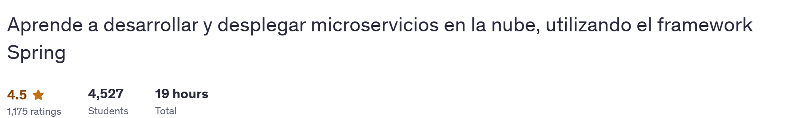

## **INFORME FINAL DE PRÁCTICAS PREPROFESIONALES**

## **ENTORNO LABORAL**

## **MODALIDAD DE ESTUDIOS:** PRESENCIAL

## **FACULTAD/UNIDAD ACADÉMICA:** INGENIERÍAS Y ARTQUITECTURA

` `**ESTUDIANTE:** Marco Abarca Rodriguez

` `**FECHA:** 10/07/2025	

` `**TUTOR ACADÉMICO:** Mgtr. Karla Romero

**TUTOR EXTERNO:** Ing. Fernanda Maricela Soto

**EMPRESA/DEPARTAMENTO INTERNO:** UTPL - CIENCIAS DE LA COMPUTACION

Abril – Agosto 2025

`  `**ÍNDICE**

1. INTRODUCCIÓN  
2. DESARROLLO  
   2.1 PROYECTO  
   2.2 ACTIVIDADES DEL PROYECTO  
   2.3 RELACIÓN CON PERFIL DE EGRESO Y COMPETENCIAS  
3. ANEXOS

---

1. **INTRODUCCIÓN**

Este informe recoge lo realizado y aprendido durante mis prácticas preprofesionales de abril a julio 2025 en la UTPL, dentro del Departamento de Ciencias de la Computación. El foco principal fue la instalación, configuración y mejora de sistemas operativos (Windows 11 y distros de Linux) en diferentes equipos, siendo esta tarea la más compleja y demandante. Cada laptop fue un mundo diferente, y la solución de errores (drivers, particiones, arranque, GUI) nos tomó más tiempo del esperado, sobre todo por la falta de experiencia previa. En segundo plano, están las capacitaciones técnicas, entre ellas el curso de Spring Boot, el cual está en progreso y apenas llevo un 33% del avance a la fecha de este informe.

El total de horas dedicadas a la fecha es de **100.27 horas**, sumando el trabajo real invertido en instalaciones, resolución de problemas y el avance parcial en las capacitaciones.

---

2. **DESARROLLO**

Este apartado detalla el trabajo realizado durante mis prácticas preprofesionales en la UTPL, dentro del Departamento de Ciencias de la Computación, de abril a julio de 2025. El proyecto principal consistió en el diseño, levantamiento y desarrollo de una base de datos para sostener el Formulario MSP-008, un documento clave en el ámbito de la salud. La meta fue establecer los fundamentos de su base de datos en una plataforma funcional, dividida en secciones para facilitar su uso y mejorar la eficiencia en los centros de salud. El desafío más significativo fue identificar y segregar todas las entidades del formulario de manera clara y adaptada a los requerimientos técnicos, lo cual demandó aprender nuevas herramientas y enfrentar problemas técnicos imprevistos, especialmente por mi falta de experiencia previa en PostgreSQL.

Además, participé en capacitaciones técnicas, como un curso de Spring Boot (33% completado a la fecha) y sesiones sobre herramientas de desarrollo web. El total de horas dedicadas hasta ahora asciende a **100.27 horas**, que incluyen la instalacion del sistema operativo `Linux Arch` en mi computadora basada en ARM64, instalacion y configuracion de herramientas/paquetes, el desarrollo de la base de datos, la programación a nivel backend, la resolución de problemas técnicos y la participación en reuniones de coordinación.

### 2.1 PROYECTO Y HORAS DEDICADAS

| **Actividad**                                                | **Fecha de inicio** | **Fecha fin**       | **Horas dedicadas** | **Referencia/Log/Imagen**                                    |
| ------------------------------------------------------------ | ------------------- | ------------------- | ------------------- | ------------------------------------------------------------ |
| Capacitaciones técnicas (Spring Boot, IDEs, MariaDB, DBeaver) | 16/05/2025          | 11/07/2025          | 4                   | [image-20250529103556749.png](./assets/images/image-20250529103556749.png) |
| Comparativa IDEs (NetBeans vs Eclipse, setup arm64)          | 29/05/2025          | 29/05/2025          | 2                   | [image-20250529103556749.png](assets/images/image-20250529110318151.png) |
| Primera Reunión del Proyecto (con tutores externos)          | 29/05/2025 3:00 pm  | 29/05/2025 6:00 pm  | 3                   |                                                              |
| Respaldo y limpieza de discos, liberación de espacio         | 30/05/2025          | 04/06/2025          | 6                   | [IMG_20250625_011139.jpg](./assets/images(arch-linux-mar)/IMG_20250625_011139.jpg) |
| Instalación y configuración de Windows 11 Pro                | 30/05/2025          | 06/06/2025          | 8                   | [IMG_20250605_151906.jpg](assets/images(manjaro-javier)/IMG_20250605_151906.jpg) |
| Documentación, bitácoras y anexos                            | 01/06/2025          | 10/07/2025          | 7                   | [Bitacoras/Actividades/](Bitacoras/Actividades/)             |
| Curso de Spring Boot y Docker                                | 03/06/2025          | 18/07/2025          | 1 hora : 42 Minutos |   9% * 19 horas = 1.71 horas |
| Instalación y configuración de Arch Linux ARM64 (Asus Vivobook) | 04/06/2025          | 26/06/2025          | 20                  | [IMG_20250626_210013.jpg](assets/images(arch-linux-mar)/IMG_20250626_210013.jpg) |
| Instalación y configuración de Manjaro XFCE (Lenovo Legion)  | 05/06/2025          | 14/06/2025          | 7                   | [Aspose.Words.16616b24-454d-4237-9dc3-c2161c0c08f1.004.jpeg](assets/images(manjaro-javier)/Aspose.Words.16616b24-454d-4237-9dc3-c2161c0c08f1.004.jpeg) |
| Resolución de errores graves (dual boot, GRUB, GUI, drivers, idioma) | 06/06/2025          | 26/06/2025          | 7                   | [Bitacoras/Actividades/](Bitacoras/Actividades/)             |
| Instalación y configuración de Arch x64 (Victus 16 Intel)    | 10/06/2025          | 18/06/2025          | 10                  | [IMG_20250629_170758.jpg](assets/images(arch-linux-mar)/IMG_20250629_170758.jpg) |
| Segunda Reunión del Proyecto                                 | 14/06/2025 11:00 am | 14/06/2025 12:30 am | 1.5                 |                                                              |
| Tercera Reunión del Proyecto                                 | 27/06/2025 3:00 pm  | 27/06/2025 6:30 pm  | 3.5                 | **Nota**: Nos quedamos tiempo adicional para empezar, y distribuirnos el trabajo de los modelos Conceptuales, Logico y Fisico. |
| Creación del Modelo Conceptual (ER, drawio, png)             | 28/06/2025          | 30/06/2025          | 7                   | [GRUPO Backend/Modelo Conceptual - Proyecto MSP.drawio](Actividades/GRUPO%20Backend/Modelo%20Conceptual%20-%20Proyecto%20MSP.drawio), [Modelo Conceptual.png](Actividades/GRUPO%20Backend/Modelo%20Conceptual.png) |
| Creación del Modelo Lógico                                   | 30/06/2025          | 03/07/2025          | 5                   | [GRUPO Backend/Modelo Logico - Proyecto MSP.drawio](Actividades/GRUPO%20Backend/Modelo%20Logico%20-%20Proyecto%20MSP.drawio), [Modelo Logico.png](Actividades/GRUPO%20Backend/Modelo%20Logico.png) |
| Curso de Git y GitHub                                        | 02/07/2025          | 18/07/2025          | 1 hora : 33 Minutos |    13% * 12 horas = 1.56 horas |
| Implementación del Modelo Físico (PostgreSQL, SQL)           | 03/07/2025          | 05/07/2025          | 5                   | [GRUPO Backend/Modelo Fisico - Proyecto MSP.sql](Actividades/GRUPO%20Backend/Modelo%20Fisico%20-%20Proyecto%20MSP.sql) |

**Total de horas dedicadas:** **100 horas y 15 min**

El cálculo refleja lo hecho hasta ahora, considerando el avance parcial en Spring Boot y otras capacitaciones. Se evidencia en bitácoras y logs, sin inflar el trabajo ni omitir tareas relevantes. El resto hasta 96h se prevé completar en las próximas semanas, avanzando en el curso y afinando detalles finales.

**Suma total de horas:**
Antes: 71 horas
Nuevas actividades (reuniones + modelos): 3 + 2.5 + 3.5 + 7 + 5 + 5 + 1.71+1.56 = 29.27 horas
**Total actualizado: 100.27 horas**

#### Logs e imágenes claves:

- [IMG_20250625_011139.jpg](assets/images(arch-linux-mar)/IMG_20250625_011139.jpg): particionado ARM64  
- [IMG_20250626_210013.jpg](assets/images(arch-linux-mar)/IMG_20250626_210013.jpg): /etc/fstab ARM64  
- [IMG_20250629_170758.jpg](assets/images(arch-linux-mar)/IMG_20250629_170758.jpg): actualización de sistema  
- [Aspose.Words.16616b24-454d-4237-9dc3-c2161c0c08f1.004.jpeg](assets/images(manjaro-javier)/Aspose.Words.16616b24-454d-4237-9dc3-c2161c0c08f1.004.jpeg): instalación Manjaro XFCE  
- [image-20250529103556749.png](assets/images/image-20250529103556749.png): entorno Eclipse arm64  
- [IMG_20250605_151906.jpg](assets/images(manjaro-javier)/IMG_20250605_151906.jpg): compilación Windows 11 Pro

---

### 2.3 RELACIÓN CON PERFIL DE EGRESO Y COMPETENCIAS

|        **Resultados de aprendizaje de la asignatura**        | 
**Contribución**

**(inicial, medio, final)**
 |     **Resultado/s de aprendizaje del perfil de egreso**      |
| :----------------------------------------------------------: | :-------------------------------------------------------: | :----------------------------------------------------------: |
| Aplica los principios metodológicos básicos de una Revisión Sistemática de Literatura, como soporte académico base. |                          Inicial                          | Construir modelos de software adecuados que permitan validar un producto previo a su implementación. |

De igual manera, también apoyan a la obtención de las competencias del perfil profesional relacionadas con la asignatura Practicum 1.2, competencias de la carrera y resultados de aprendizaje según el plan de estudio de la asignatura:

|           **Competencias del perfil profesional.**           |                **Competencias de la carrera**                |                **Resultados de Aprendizaje**                 |
| :----------------------------------------------------------: | :----------------------------------------------------------: | :----------------------------------------------------------: |
| Definir, diseñar, implementar, mantener y evaluar soluciones computacionales basadas en atributos de calidad internacionales que permitan la toma de decisiones sobre grandes volúmenes de datos, monitoreando e interpretando cambios para generar nuevas ideas que fomenten la investigación, el desarrollo e innovación tecnológica, en colaboración con equipos multidisciplinarios integrando valores éticos y normas sociales adecuadas. | Uso de herramientas para la gestión y administración de sistemas; trabajo colaborativo; documentación técnica. | Capacidad de resolver problemas técnicos complejos y documentar soluciones. |

| Implementa aplicaciones a partir de especificaciones y modelos de software utilizando estándares de documentación y de programación. |
| :----------------------------------------------------------- |

|      |      |      |
| :--- | ---- | ---- |

| Aplica los principios metodológicos básicos de una Revisión Sistemática de Literatura, como soporte académico base. |
| :----------------------------------------------------------- |

|      |      |      |
| :--- | ---- | ---- |

---

3. **ANEXOS**
   1. **ANEXO 1**  
      Respaldos, capturas y comandos para liberar espacio. [[Bitacoras/Actividades/](Bitacoras/Actividades/) y [assets/images/](assets/images/)]
   2. **ANEXO 2**  
      Instalación de Windows 11 Pro, logs y capturas de errores. [[assets/images(manjaro-javier)/](assets/images(manjaro-javier)/)]
   3. **ANEXO 3**  
      Instalaciones de Arch Linux ARM64, Manjaro XFCE y Arch x64; problemas de GRUB, drivers, fstab. [[Bitacoras/Actividades/ y assets/images(arch-linux-mar)/](Bitacoras/Actividades/ y assets/images(arch-linux-mar)/)]
   4. **ANEXO 4**  
      Comparativa de IDEs, configuración de Eclipse/MariaDB, bitácora de curso Spring Boot. [[Bitacoras/Capacitaciones/](Bitacoras/Capacitaciones/) y [assets/images/](assets/images/)]
   5. **ANEXO 5**
      - “Los modelos Conceptual, Lógico y Físico, así como las bitácoras, están documentados en: [GRUPO Backend - Modelos Conceptual, Logico Fisico.md](Actividades/GRUPO Backend/GRUPO Backend - Modelos Conceptual, Logico Fisico.md) y sus respectivos archivos .drawio/.png/.sql.”

---

| 

                                 |
| ------------------------------------------------------------ |
| 
Firma del estudiante:

Marco Abarca Rodriguez

 |
| **                                                           |

|      |
| ---- |
|      |
|      |